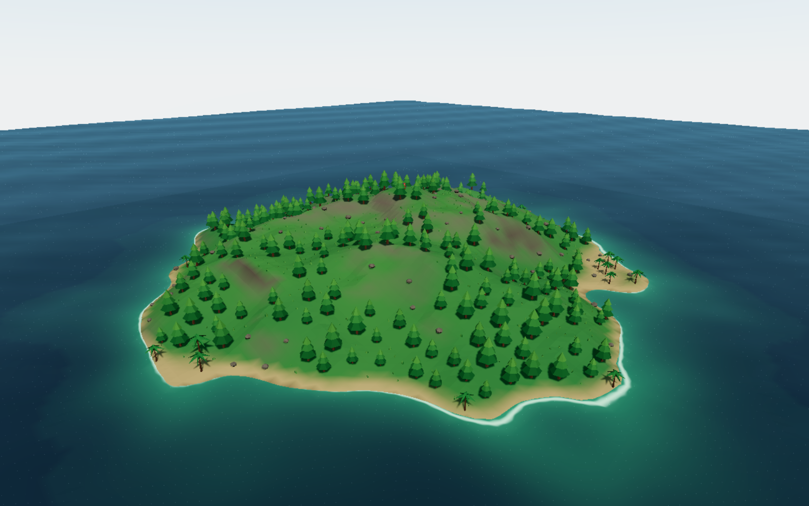
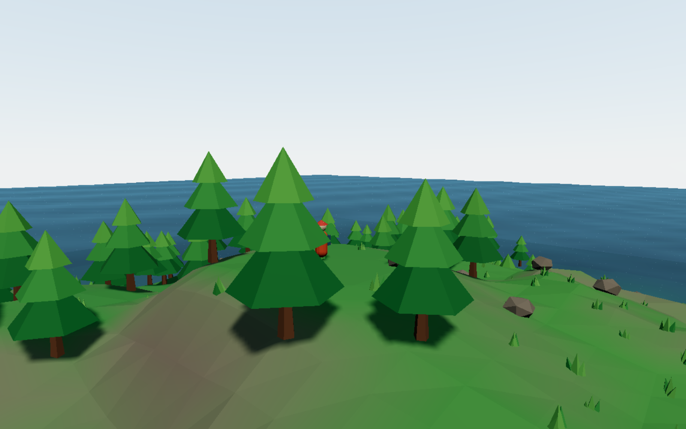

# 孤岛漫游 · Island Walk

> 仓库:https://github.com/liuxu-m/island-3d

3D 海岛漫游原型:程序化海岛 + 大海水面 + 第三人称角色(走/跑/跳/游泳)。





严格遵循 Obsidian《AI 3D游戏开发方案》的硬决策:

| 方案条款 | 本项目落实 |
|---|---|
| 平坦世界,不做球面 | 平面地形 + 岛掩码 |
| 零物理引擎 | 解析式 `heightAt(x,z)` 做地面吸附,全场唯一高度真源 |
| R3F 组织场景 + 原生 three 热路径 | `App.tsx` 组织,InstancedMesh 直出 |
| LLM 输出"生成地图的程序" | `src/world/layout.ts`:scatter/ring 规则 + Poisson 间距求解器,改一行规则地图就变 |
| 不做编辑器 | 地图即代码,可 diff 可 review |
| 三条命脉 | `npm run verify`(L1 数值断言)+ `npm run shot`(Playwright 截图回环) |
| 性能预算(3K 屏 + Arc 核显) | 内部渲染 ≈1280 宽再放大 / 植被全 InstancedMesh(4 个 draw call)/ 动态光 ≤2 / 地形 ~51k 三角形 / 雾遮远景 |

## 跑起来

```bash
git clone https://github.com/liuxu-m/island-3d.git
cd island-3d
npm install
npm run dev        # http://localhost:5199
```

操作:点击画面锁定鼠标,WASD 移动,Shift 疾跑,Space 跳跃,R 回出生点,走进海里自动游泳。

## 验证栈(先从这两条命令建立信任)

```bash
npm run verify     # vitest:14 条断言——出生点在海面上、海岸线存在、求解确定性、
                   # 最小间距、树不在水里、棕榈在沙滩带、实例数/三角形预算……
npm run shot       # 固定机位截图到 shots/latest.png(复用本机 Chrome,无需下载浏览器)
```

## 目录

```
src/world/noise.ts      确定性噪声(mulberry32 + 值噪声 + fbm + ridged)
src/world/terrain.ts    heightAt / slopeAt / biomeAt —— 解析地形唯一真源
src/world/layout.ts     布局 DSL + 求解器 ← 想改地图就改这里
src/world/Terrain.tsx   地形网格,顶点色按生态着色(沙滩/草/岩/崖壁)
src/world/Water.tsx     海面 shader:波浪 + 水深混色 + 岸线泡沫 + 菲涅尔
src/world/Vegetation.tsx 程序化低模树/棕榈/岩石/草,全 InstancedMesh
src/player/Player.tsx   角色控制(街机手感)+ 第三人称相机(不穿山不入水)
src/ui/HUD.tsx          操作提示 + FPS/坐标
scripts/shot.mjs        截图回环
src/world/verify.test.ts L1 断言
```

## 环境备注(Windows + Node 22)

若 `npm install` 卡在 esbuild/rollup 阶段,可按顺序处理:

```bash
npm install --ignore-scripts                 # 1. 跳过 postinstall
node node_modules/esbuild/install.js         # 2. 手动补 esbuild 二进制
npm i --no-save @rollup/rollup-win32-x64-msvc # 3. 补 npm 漏装的平台可选依赖
```

## 已知边界(后续阶段的事)

- 无玩法动词(捡/推/躲/射/搭)—— 方案 P1 的事
- 程序化占位资产,未接 GLB 资产管线 —— 方案 P0 命脉之一,接真实资产前补
- 树木无碰撞(可以穿树)—— 引入玩法时再决定要不要 Rapier
